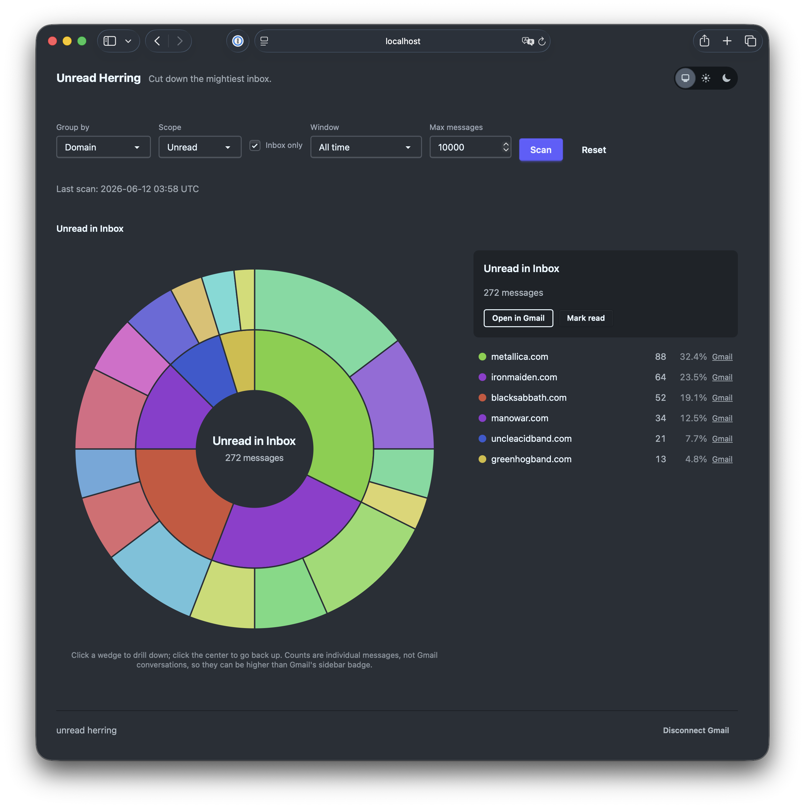

# Unread Herring

> *"Cut down the mightiest inbox."*

A local-first, open-source Elixir tool that scans your Gmail, renders an
interactive **sunburst** of where your mail comes from (grouped by sender
domain, sender, or label), lets you drill down through the rings, and lets you
click a wedge to open that exact filtered view in Gmail. Built on Phoenix
LiveView; launched from the terminal.

Nothing leaves your machine except calls to the Gmail API itself. No database,
no hosted service, no telemetry, no shipped credentials.

<p align="center">
  
</p>

## Use at your own risk

This tool **bulk-modifies your real mailbox**. By using it you accept that you
do so entirely at your own risk and that you know what you are doing:

- You should understand what you are granting when you create the OAuth
  client and approve the `gmail.modify` scope, and what mark-read / archive /
  trash mean when applied to thousands of messages at once.
- Confirmations and a one-step undo exist, but undo covers only the **last**
  action, and Gmail **permanently purges trashed messages after about 30
  days** - after that nothing can bring them back.
- The software is provided as is, without warranty of any kind (see
  [LICENSE](LICENSE)). The authors are not responsible for lost or altered
  mail.

If any of the above gives you pause, explore with `scope: all` + "Open in
Gmail" links only, and leave the bulk action buttons alone.

## How it works

1. `mix herring.serve` boots an OTP app with a Phoenix endpoint bound to
   `127.0.0.1` and opens your browser.
2. The first time, you are sent through a one-time Google OAuth flow (a
   loopback redirect back to the same local endpoint). The token is stored in
   `~/.config/unread_herring/token.json` with `0600` permissions.
3. Pick a grouping (domain / sender / label), scope (unread / all) and time
   window, hit **Scan**, and watch the live progress bar while the BEAM fans
   out concurrent Gmail metadata reads. Scans cover the Inbox by default
   (matching Gmail's sidebar badge); untick "Inbox only" to include archived
   and filtered-away mail. Counts are individual messages, not conversations.
4. Explore the sunburst: click a wedge to drill down, click the center to go
   back up, click "Open in Gmail" to see the real filtered view, or bulk
   mark-read / archive / trash a bucket (trash is the ceiling - the app never
   permanently deletes anything). Every bulk action asks for confirmation
   (twice when it targets the whole scan result), acted-on buckets gray out
   until the next scan, and the last action can be undone with one click.
   "Disconnect Gmail" revokes the app's authorization at Google and deletes
   the stored token and local scan cache when you are done.

## Setup: bring your own OAuth client (required)

This project **requires Google credentials** to work. You create your own OAuth
client in your own Google Cloud project, so your data is only ever between
you and Google:

1. Go to [Google Cloud Console](https://console.cloud.google.com/) and create
   a project (any name, e.g. `unread-herring`).
2. Enable the **Gmail API**: APIs & Services -> Library -> Gmail API -> Enable.
3. Configure the OAuth consent screen: External, fill in the app name and
   your email, and add **yourself** as a test user. Leave the app in
   **Testing** mode - with only you as a user this is exempt from Google's
   verification and CASA assessment.
4. Create credentials: APIs & Services -> Credentials -> Create Credentials ->
   OAuth client ID -> Application type **Desktop app**.
5. Hand the client to Unread Herring either way:
   - download the JSON and save it as
     `~/.config/unread_herring/credentials.json`, **or**
   - export environment variables:

     ```sh
     export GOOGLE_CLIENT_ID="...apps.googleusercontent.com"
     export GOOGLE_CLIENT_SECRET="..."
     ```

> **Note:** while the consent screen is in Testing mode, Google may expire
> refresh tokens after about 7 days; just re-run the auth flow when prompted.

## Running

```sh
mix deps.get
mix herring.serve     # boots on http://127.0.0.1:4000 and opens your browser
```

Useful extras:

```sh
mix herring.smoke     # prints sender-domain counts to stdout (API smoke test)
mix test              # full test suite; no live Gmail calls anywhere
```

## Limits and tuning

- **Scan cap.** A scan fetches at most **10,000 messages** by default
  (newest first). Each scanned message costs one Gmail metadata request, and
  Gmail's per-user quota works out to roughly 50 requests/second, so 10,000
  messages take a few minutes. When a scan hits the cap the dashboard shows
  a warning, since the chart then only reflects the most recent slice.
  Adjust the cap per scan with the **"Max messages"** box in the dashboard
  controls (up to 100,000), or change the default it starts with:

  ```sh
  HERRING_SCAN_MAX=50000 mix herring.serve
  ```

- **Bulk actions** (mark read / archive / trash) apply to at most 10,000
  matching messages per click; the toast says "at least N" when there may
  be more, and clicking again continues where it left off.

## Privacy model

- Every user is their own Google Cloud "app", in Testing mode, scoped to
  themselves. The project never operates a shared OAuth client, so it never
  needs Google verification.
- OAuth scope ceiling is `gmail.modify`: the code can mark read, archive and
  move to trash (recoverable for 30 days), and has **no permanent-delete
  path**.
- The endpoint binds to the loopback interface only.
- On-disk state is limited to `~/.config/unread_herring/` (OAuth token,
  `0600`).

## Packaging

Build and run a standard self-contained release:

```sh
mix assets.deploy                  # compile + digest assets (prod requires the manifest)
MIX_ENV=prod mix release
PHX_SERVER=1 PORT=4000 _build/prod/rel/unread_herring/bin/unread_herring start
```

Note: `mix release` builds for the current `MIX_ENV`, so a bare invocation
produces a dev-mode release under `_build/dev/rel/...` instead - set
`MIX_ENV=prod` for the real thing.

## Development

Standard Phoenix app, no Ecto. See `unread-herring-plan.md` for the full
design document and `CLAUDE.md` for a condensed architecture overview.

## License

See [LICENSE](LICENSE).
